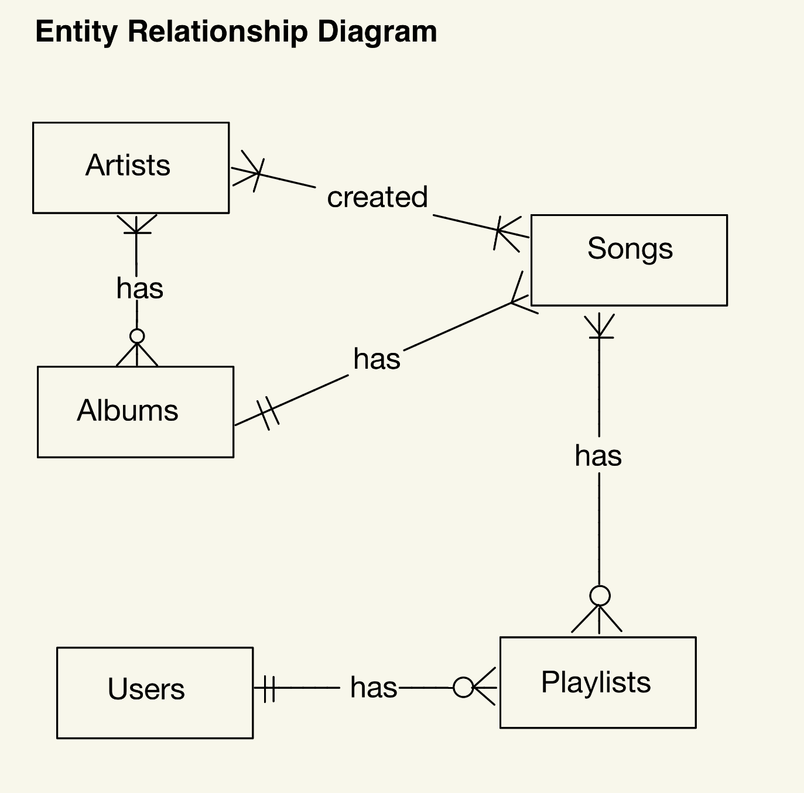

# Design Document

By Gregory Adiprawira

Video overview: <https://youtu.be/ZQUMjaz6G9I>

## Scope

The purpose of the database is for tracking Music and Playlists of users. The database includes the following tables:

* Artists, with id and their name.
* Albums, with id and the album's name, including the date at which the album is released to the general public.
* Album_artists, with the album_id and the artist_id that made it.
* Songs, with id, the title of the song, the genre of the song and the album_id it was in.
* Song_artists, with the song_id and the artist_id that made the song.
* Users, with id and their username.
* Playlists, with id, the name of the playlist, the user_id that created the playlist and the date it was created.
* Playlist_songs, with the playlist_id and the song_id inside the playlist.

## Functional Requirements

This database will support:

* Tracking artists, the albums they created and the songs in that album.
* Tracking users, the playlists they created and the songs in that playlist.
* Manage Artists, including adding new artists.
* Manage Albums, including adding new albums and the songs in that album.
* Manage Users, including adding new users.
* Manage Playlists, including adding new playlists and adding songs to the playlist.

Note in this iteration, the system will not be able to:

* Create collaborated playlists.
* Checking which users follow each other.
* Play songs.
* Which songs the user liked.

## Representation

### Entities

This database includes the following entities:

### Artists

The `artists` table includes:

* `id`, which is the unique ID for the artists as an `INTEGER` and is the `PRIMARY KEY` of this table.
* `name`, which is the name of the artist as `TEXT` since it is appropriate for names.

All columns in the `artists` table are required and hence should have the `NOT NULL` constraint applied. No other constraints are necessary.

### Albums

The `albums` table includes:

* `id`, which is the unique ID for the albums as an `INTEGER` and is the `PRIMARY KEY` of this table.
* `name`, which is the name of the album as `TEXT` since it is appropriate for names.
* `date`, which is the date when the album is released to the general public and is a `TEXT` since I only need the format YY-MM-DD and SQLite does not have a dedicated DATE or DATETIME data type.

All columns in the `albums` table are required and hence should have the `NOT NULL` constraint applied. No other constraints are necessary.

### Album_Artists

The `album_artists` table includes:

* `album_id`, which is the ID of the album as an `INTEGER` and a `FOREIGN KEY` referencing the `albums` table with column `id`.
* `artist_id`, which is the ID of the artist who created that album as an `INTEGER` and a `FOREIGN KEY` referencing the `artists` table with column `id`.

The combination of `album_id` and `artist_id` is the `PRIMARY KEY` for this table to ensure that each album-artist pair is unique and that there will not be a duplicate. Albums can be a collaborative album, thus this table allows an album to have multiple artists.

All columns in the `album_artists` table are required and hence should have the `NOT NULL` constraint applied. No other constraints are necessary.

### Songs

The `songs` table includes:

* `id`, which is the unique ID for the song as an `INTEGER` and is the `PRIMARY KEY` of this table.
* `title`, which is the title of the song as `TEXT` since it is appropriate for titles.
* `genre`, which is the genre of the song as `TEXT` since it is appropriate for genres. There is a check constraint that ensures each data to one of the following predefined options: 'Pop', 'Rock', 'R&B', 'Hip-hop', 'electronic', 'Country', 'Classical', 'Jazz', 'Blues'd.
* `album_id`, which is the ID of the album which the song is from as an `INTEGER` and a `FOREIGN KEY` referencing the `albums` table with column `id`.

All columns except for `album` in the `songs` table are required and hence should have the `NOT NULL` constraint applied. The `album_id` does not have `NOT NULL` constraint since sometimes `artists` release songs that do not go with any album, just like a single song. No other constraints are necessary.

### Song_Artists

The `song_artists` table includes;

* `song_id`, which is the ID of the song as an `INTEGER` and a `FOREIGN KEY` referencing the `songs` table with column `id`.
* `artist_id`, which is the ID of the artist who created the song as an `INTEGER` and a `FOREIGN KEY` referencing the `artists` table with column `id`.

The combination of `song_id` and `artist_id` is the `PRIMARY KEY` for this table to ensure that each song-artist pair is unique and that there will not be a duplicate. songs can be a created by multiple artists, thus this table allows a song to have multiple artists.

All columns in the `song_artists` table are required and hence should have the `NOT NULL` constraint applied. No other constraints are necessary.

### Users

The `users` table includes:

* `id`, which is the unique ID for the users as an `INTEGER` and is the `PRIMARY KEY` of this table.
* `username`, which is the username of the user as `TEXT` since it is appropriate for usernames.

All columns in the `users` table are required and hence should have the `NOT NULL` constraint applied. No other constraints are necessary.

### Playlists

The `playlists` table includes:

* `id`, which is the unique ID for the playlist as an `INTEGER` and is the `PRIMARY KEY` of this table.
* `name`, which is the name of the playlist as `TEXT` since it is appropriate for playlist names.
* `user_id`, which is the ID of the user that created the playlist as an `INTEGER` and a `FOREIGN KEY` referencing the `users` table with column `id`.
* `date`, which is the date when the playlist is created and is a `TEXT` since I only need the format YY-MM-DD and SQLite does not have a dedicated DATE or DATETIME data type.

All columns in the `playlists` table are required and hence should have the `NOT NULL` constraint applied. No other constraints are necessary.

### Playlist_Songs

The `playlist_songs` table includes:
* `playlist_id`, which is the ID of the playlist as an `INTEGER` and a `FOREIGN KEY` referencing the `playlists` table with column `id`.
* `song_id`, which is the ID of the song in the playlist as an `INTEGER` and a `FOREIGN KEY` referencing the `songs` table with column `id`.

The combination of `playlist_id` and `song_id` is the `PRIMARY KEY` for this table to ensure that each playlist-song pair is unique and that there will not be a duplicate. Each song can be in 0, 1 or even more playlists.

All columns in the `playlist_songs` table are required and hence should have the `NOT NULL` constraint applied. No other constraints are necessary.

### Relationships

Below is the Entity Relationship diagram that describes the relationships between the entities in the database.

* There is a many-to-many relationship between artists and albums. This is because an artist can have multiple albums and an album can be created by multiple artists. However, an artist can have no albums at all since some artists create songs and release them without the song being in any albums.
* There is a many-to-many relationship between artists and songs. This is because an artist can have multiple songs and a song can be created by multiple artists. A artist is required to have one or more songs.
* There is a one-to-many relationship between songs and albums. This is because an album can have multiple songs but a song can only belong to one and only one album. Additionally, an album must have 2 or more songs in it to be considered an album.
* There is a one-to-many relationship between users and playlists. This is because a user can have multiple playlists but a playlist can only be created by one and only one user.
* There is a many-to-many relationship between playlists and songs. This is because a playlist can have multiple songs and a song can be in multiple playlists. Additionally, a song can be in no playlists at all, while a playlist need at least one song in it.

## Optimizations

Per the typical queries in queries.sql, typical queries include finding albums of an artist, finding songs of an artist, finding songs of an album, finding artist/s who created a song, finding a playlist a user made and songs in a specific playlist. Due to this I created these indexes:

* `album_artists_search`, which index on the column `artist_id` in the `album_artists` table, to speed up the identification of albums created by a specific artist_id.
* `artist_name_search`, which index on the column `name` in the `artists` table, to speed up the identification of artists by their name.
* `song_artists_search`, which index on the column `artist_id` in the `song_artists` table, to speed up the identification of songs created by a specific artist_id.
* `songs_album_search`, which index on the column `album_id` in the `songs` table, to speed up the identification of songs in a specific album_id.
* `albums_search`, which index on the column `name` in the `albums` table, to speed up the identification of albums by their name.
* `playlists_user_search`, which index on the column `user_id` in the `playlists` table, to speed up the identification of playlists created by a specific user_id.
* `users_search`, which index on the column `username` in the `users` table, to speed up the identification of users by their username.
* `songs_title_search`, which index on the column `title` in the `songs` table, to speed up the identification of songs by their title.
* `playlists_name_search`, which index on the column `name` in the `playlists` table, to speed up the identification of playlists by their name.

In addition, I also created these views to accomodate the most used query in this database:

* `artist_album`, which creates a view that joins the `albums` table with the `album_artists` on the `album_id` and also joins the `artists` table with the `album_artists` table on the `artists_id`. This creates a virtual table that has the columns `album` and `artist`, where each row represents an album and its corresponding artist who created it.

* `artist_song`, which creates a view that joins the `songs` table with the `song_artists` on the `song_id` and also joins the `artists` table with the `song_artists` table on the `artists_id`. This creates a virtual table that has the columns `song` and `artist`, where each row represents a song and its corresponding artist who created it.

* `album_song`, which creates a view that joins the `songs` table with the `albums` table on the `album_id`. This creates a virtual table that has the columns `song` and `album`, where each row represents a song and its corresponding album.

## Limitations

Limitations of the design:

* The current schema assumes a playlist is created by one user. Due to this, collaborative playlists would require to change the one-to-many relationship of users and playlists to a many-to-many relationship.
* There are currently limited genre representations with only 'Pop', 'Rock', 'R&B', 'Hip-hop', 'electronic', 'Country', 'Classical', 'Jazz', 'Blues'.

Things the database might not be able to represent very well:

* Some songs have multiple artists with each different roles. For instance in Justin Bieber's song 'Love Yourself", Ed Sheeran wrote the lyrics of the song. This schema would not be able to represent the roles of artists such as vocals, writers and producers.
